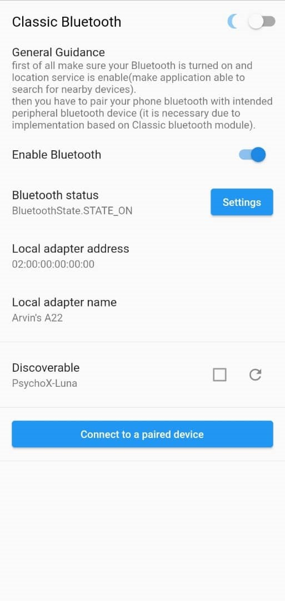
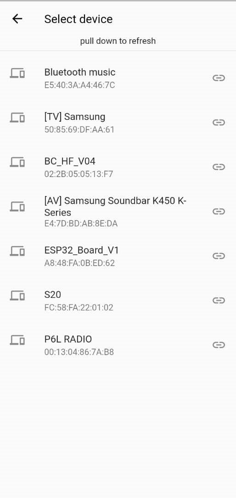

# smart_socks_iot
an android project developed in flutter. the main idea behind the application is stablish  a connection to a SMART SOCKS which has 6 temperature sensor to track temperature status in real time. data and information recorded by the sensors will be sent to application using classic Bluetooth. all are implemented in two theme of light and dark

## what does application do?
application UI consists of one section for setting up Bluetooth settings and configs and turning it on or of, one section for selecting and connecting to desired device, and one section (which comes after the connection to respective device stablished) for sending and receiving and representing data.
- application is responsible for representing data in the first place. two three form of representation is provided. first form of presenting data is in the raw format and show them as they have been received. second form is graphic representation using line Chart. third form is presenting data on a foot scheme with value of the sensors on it on the exact place that sensors are on under the sole of foot.
- application is also capable of sending data to the Bluetooth device in the form of real-time conversation.
- also you can export all the conversation from connection establishment so far.

### Screenshots

